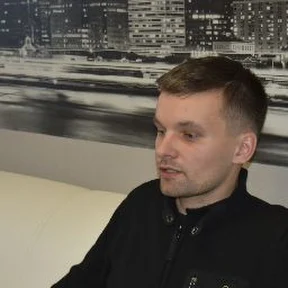

# Andrei Ordzich
## Junior front-end developer


***

##### Contacts
##### Minsk, Belarus
##### Email: dronpoet@gmail.com
##### Github: AndreiOrdzich
##### Telegram: !!!!!
##### Discord: Andrei Ordzich #1038

***

#### About me

I have been interested in frontend technologies for a long time. I like to constantly learn something new and immediately put it into practice. I have my main job and programming is my hobby. I have taken many frontend courses and would like to participate in a real project. My immediate goal is to learn JavaScript and TypeScript at a good level and further learn the React library. I would be happy to gain practical experience in various open source projects in order to gain practical experience under the guidance of experienced developers.

***

#### Skills
* Web-development: HTML5, CSS3, JavaScript
* IDE: VScode
* Version control: GIT, Github
* Graphics: Figma
* DevTools: Chrome DevTools, Firebug

***
#### Code 
``` 
function counter1 () {
    button1 = document.getElementById('button1');
    var count1 = 0; //the current value is written here
    button1.innerHTML = count1; 
    
    button1.onclick = function (e) {
        e = e || event;
        var target1 = e.target || e.srcElement;
        if (target1.className == 'but1') {
            count1++;
            button1.innerHTML = count1;

        }
    }
}
```
***
#### Courses

* Codeacademy - HTML/CSS (online)
* FreeCodeCamp - HTML/CSS/JS (online)
* It-academy - JavaScript Web Application Development (offline)

***
#### Projects

* Luxestate
* WildVacation
* Roadside Studio

***

#### Education 
* Gomel State Vocational and Technical College of Electrical Engineering
* FRANCISK SKORINA GOMEL STATE UNIVERSITY

***

#### Languages

* English: B1 - Pre-Intermediate
* Polish: B2 - Upper-intermediate
* Ukrainian: C1 -  Advanced